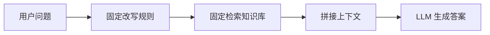
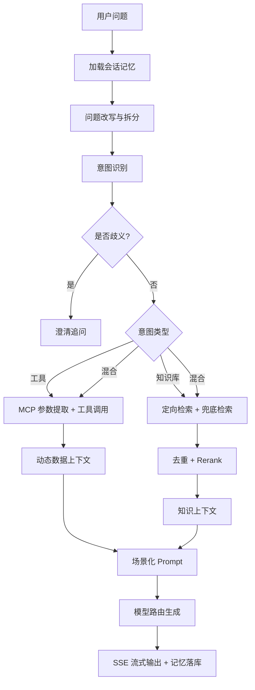
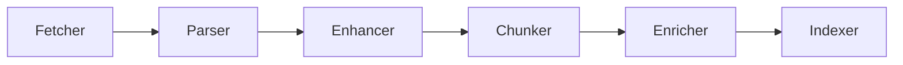

# Ragent Agentic RAG 实现学习文档

本文面向第一次接触 Agentic RAG 的同学。你之前做过“业务编排式 RAG”，通常意味着流程大致是固定的：

```text
用户问题 -> 改写/检索 -> 拼 Prompt -> 调 LLM -> 返回答案
```

Ragent 的核心变化是：它不再把“检索”当成一段固定管道，而是让系统围绕问题动态做决策：

- 要不要改写问题？
- 要不要把一个问题拆成多个子问题？
- 应该走知识库，还是走业务工具，还是两者都走？
- 应该查哪个知识库？
- 意图不清楚时，是硬猜答案，还是先追问用户？
- 检索结果不够稳时，要不要启用全局兜底检索？
- 多个来源的结果如何去重、重排、再交给模型回答？

这就是 Agentic RAG 的基本思想：**让 RAG 具备“感知、规划、选择工具、执行、整合、观察”的能力**。Ragent 没有做成完全自由行动的自主 Agent，而是采用更适合企业落地的“可控 Agentic Workflow”：关键决策由 LLM 辅助，但执行路径被工程代码约束住。

## 一、先看项目整体结构

Ragent 是一个 Java 17 + Spring Boot 3 + React 的企业级 RAG 项目，后端是 Maven 多模块。

```text
ragent/
├── bootstrap/     # 业务主模块：RAG 问答、知识库、入库流水线、管理接口
├── framework/     # 通用框架能力：Result、异常、用户上下文、幂等、MQ、Trace、SSE
├── infra-ai/      # AI 基础设施：LLM、Embedding、Rerank、模型路由与故障转移
├── mcp-server/    # 示例 MCP 工具服务：天气、工单、销售等工具
├── frontend/      # React 管理后台和问答页面
├── resources/     # 数据库脚本、Docker Compose、示例资料
└── docs/          # 项目文档
```

后端核心分层可以这样理解：

| 模块 | 你可以把它理解成 | 关键价值 |
| --- | --- | --- |
| `framework` | 企业应用通用底座 | 不和 RAG 业务耦合，提供上下文、SSE、幂等、Trace 等能力 |
| `infra-ai` | 模型供应商适配层 | 屏蔽百炼、硅基流动、Ollama 等模型调用差异 |
| `bootstrap` | RAG 业务大脑 | 负责问答编排、意图、检索、工具、记忆、Prompt、知识入库 |
| `mcp-server` | 外部工具示例服务 | 模拟业务系统能力，让 Agent 不只会查文档，还能查动态数据 |

最值得新手先读的路径是：

```text
bootstrap/src/main/java/com/nageoffer/ai/ragent/rag/service/impl/RAGChatServiceImpl.java
```

这个类是一次问答的“总导演”。

## 二、传统 RAG 和 Agentic RAG 的差异

### 1. 传统业务编排式 RAG

你以前实现过的 RAG 很可能是这样的：



它的优点是简单、稳定、可控。问题是：一旦用户问题复杂、含糊、跨多个知识库、需要实时业务数据，就容易失败。

典型失败场景：

- 用户问“这个系统怎么申请权限”，但“这个系统”依赖上一轮对话。
- 用户一次问两个问题，检索只围绕第一个问题。
- 用户问“北京明天天气和出差制度”，一个需要工具，一个需要知识库。
- 用户问“数据安全怎么做”，多个业务系统都有“数据安全”文档，系统不知道该查哪个。
- 向量检索没召回，系统直接回答“没有资料”，但其实换个检索策略能找到。

### 2. Agentic RAG

Agentic RAG 的核心不是“用了 Agent 框架”，而是**检索行为由问题状态驱动**。



你可以把 Ragent 的 Agentic RAG 概括为一句话：

> 用 LLM 做问题理解、意图路由、参数提取和摘要压缩；用工程代码约束检索通道、工具调用、结果后处理和模型容错。

## 三、一次用户提问在 Ragent 中怎么流转

入口在：

```text
bootstrap/src/main/java/com/nageoffer/ai/ragent/rag/controller/RAGChatController.java
```

接口是：

```text
GET /rag/v3/chat?question=...&conversationId=...&deepThinking=false
```

控制器创建 `SseEmitter`，然后调用：

```text
RAGChatServiceImpl.streamChat(...)
```

`RAGChatServiceImpl` 的主流程非常适合作为学习索引：

```text
1. 创建 conversationId / taskId
2. 创建 StreamCallback，用于 SSE 流式输出
3. 加载会话记忆并追加用户问题*
4. 问题改写与多问题拆分
5. 子问题并行意图识别
6. 歧义检测，必要时向用户追问*
7. 判断是否是纯系统类问题
8. 调 RetrievalEngine 检索知识库和/或执行 MCP 工具
9. 根据 KB / MCP / 混合场景组装 Prompt
10. 通过 LLMService 流式生成
11. 输出完成后保存 assistant 消息，并触发摘要压缩
```

对应代码：

```text
bootstrap/src/main/java/com/nageoffer/ai/ragent/rag/service/impl/RAGChatServiceImpl.java
```

这段代码是从传统 RAG 过渡到 Agentic RAG 的关键，因为它体现了“编排器”的角色：

- 它不直接写死检索哪张表或哪个知识库。
- 它先让改写、意图、澄清、检索、工具模块分别判断。
- 它把各模块结果合成 `PromptContext`，再交给 LLM。

## 四、机制一：会话记忆 Memory

### 1. 为什么 Agentic RAG 需要记忆

传统单轮 RAG 只看当前问题。Agentic RAG 要处理多轮任务，就必须知道用户刚才问过什么。

例如：

```text
用户：OA 系统怎么申请权限？
用户：那移动端呢？
```

第二句里的“那”必须靠历史上下文还原。

Ragent 的记忆入口：

```text
bootstrap/src/main/java/com/nageoffer/ai/ragent/rag/core/memory/DefaultConversationMemoryService.java
```

核心逻辑：

- `load(...)`：并行加载历史摘要和最近消息。
- `append(...)`：写入新消息。
- 写入 assistant 消息后触发 `summaryService.compressIfNeeded(...)`。

### 2. 摘要压缩机制

实现类：

```text
bootstrap/src/main/java/com/nageoffer/ai/ragent/rag/core/memory/JdbcConversationMemorySummaryService.java
```

它做的事情是：

- 超过配置轮次后，异步触发摘要。
- 用 Redisson 分布式锁避免同一会话并发摘要。
- 只保留最近若干轮原始对话，较早内容压缩成摘要。
- 摘要作为 `system` 消息塞回历史。

配置在：

```yaml
rag:
  memory:
    history-keep-turns: 4
    summary-start-turns: 5
    summary-enabled: true
    summary-max-chars: 200
```

新手要注意：Ragent 的摘要不是为了替代知识库答案，而是为了告诉模型“用户之前讨论过什么”。它的 `conversation-summary.st` 里也明确要求不要记录具体答案，避免旧摘要和最新文档冲突。

## 五、机制二：问题改写与拆分

入口接口：

```text
bootstrap/src/main/java/com/nageoffer/ai/ragent/rag/core/rewrite/QueryRewriteService.java
```

实现类：

```text
bootstrap/src/main/java/com/nageoffer/ai/ragent/rag/core/rewrite/MultiQuestionRewriteService.java
```

这一步做两件事：

### 1. Query Rewrite

把用户口语化问题改写成适合检索的形式。

例如：

```text
请帮我详细介绍一下 OA 系统的审批流程
```

可以改成：

```text
OA 系统审批流程
```

Ragent 先走 `QueryTermMappingService.normalize(...)` 做术语归一化，再用 LLM 按 `user-question-rewrite.st` 输出 JSON。

### 2. Multi-question Split

如果用户一次问多个问题，就拆成多个子问题。

例如：

```text
OA 系统怎么申请权限？移动端审批怎么操作？
```

会拆成：

```text
1. OA 系统怎么申请权限
2. OA 系统移动端审批怎么操作
```

为什么这很 Agentic？因为后续不是对“一个大问题”做一次检索，而是对每个子问题分别识别意图、分别检索，最后再合并上下文。

## 六、机制三：意图识别 Intent Routing

意图识别是 Ragent Agentic RAG 的大脑之一。

核心类：

```text
bootstrap/src/main/java/com/nageoffer/ai/ragent/rag/core/intent/IntentResolver.java
bootstrap/src/main/java/com/nageoffer/ai/ragent/rag/core/intent/DefaultIntentClassifier.java
```

### 1. 意图树

Ragent 的意图不是简单标签，而是树形结构：

```text
领域 Domain
└── 类目 Category
    └── 话题 Topic
```

意图节点里还可以配置：

- `kind`：KB、MCP、SYSTEM
- `collectionName`：该意图应该检索哪个向量集合
- `mcpToolId`：该意图应该调用哪个工具
- `promptTemplate`：该意图专属回答模板
- `promptSnippet`：该意图专属回答规则
- `topK`：该意图专属检索数量

也就是说，意图节点不仅是分类结果，还是后续行动的配置。

### 2. LLM 分类

`DefaultIntentClassifier` 会把所有叶子意图节点拼到 `intent-classifier.st`，让 LLM 返回：

```json
[
  {"id": "biz-oa-security", "score": 0.92, "reason": "问题涉及 OA 系统数据安全要求"}
]
```

然后 `IntentResolver` 会：

- 对每个子问题并行分类。
- 过滤低于阈值的意图。
- 限制总意图数量，避免 Prompt 和检索爆炸。
- 把意图拆成 KB 意图和 MCP 意图。

配置阈值主要体现在：

```text
RAGConstant.INTENT_MIN_SCORE
RAGConstant.MAX_INTENT_COUNT
```

### 3. 为什么这比传统 RAG 更强

传统 RAG 常常只有一个默认知识库。Ragent 则是：

```text
问题 -> 意图 -> 知识库 / 工具 / 系统回答路径
```

这就是典型的 Agentic Routing：先理解任务类型，再选择最合适的后续动作。

## 七、机制四：歧义澄清 Guidance

核心类：

```text
bootstrap/src/main/java/com/nageoffer/ai/ragent/rag/core/guidance/IntentGuidanceService.java
```

它解决的问题是：当多个意图都可能相关时，不急着回答，而是先问用户。

例如用户只问：

```text
数据安全怎么做？
```

但知识库里可能有：

```text
OA 系统 / 数据安全
保险系统 / 数据安全
营销系统 / 数据安全
```

Ragent 会判断：

- 是否只有一个子问题。
- 是否有多个分数接近的 KB 意图。
- 这些意图是否属于不同系统。
- 用户问题中是否已经明确提到了某个系统名。

如果确实歧义，就用 `guidance-prompt.st` 生成追问：

```text
关于数据安全，在知识库中检索到了以下内容：
1) OA 系统
2) 保险系统

请问你具体想了解哪个？
```

这一步非常有企业价值：**宁可多问一句，也不要查错系统后给错答案**。

## 八、机制五：知识库检索 Retrieval Engine

总入口：

```text
bootstrap/src/main/java/com/nageoffer/ai/ragent/rag/core/retrieve/RetrievalEngine.java
```

它负责同时处理两类上下文：

- KB Context：知识库检索结果。
- MCP Context：工具调用返回的动态数据。

### 1. 子问题并行执行

`RetrievalEngine.retrieve(...)` 会对每个 `SubQuestionIntent` 并行构建上下文。

每个子问题内部再分两路：

```text
KB 意图 -> retrieveAndRerank(...)
MCP 意图 -> executeMcpAndMerge(...)
```

这说明 Ragent 不是“RAG 或工具二选一”，而是支持混合：

```text
用户问题 = 查制度 + 查实时数据
最终上下文 = 文档内容 + 动态数据
```

## 九、机制六：多通道检索 Multi-channel Retrieval

核心类：

```text
bootstrap/src/main/java/com/nageoffer/ai/ragent/rag/core/retrieve/MultiChannelRetrievalEngine.java
```

这是 Ragent 比普通向量 RAG 更接近 Agentic RAG 的地方。

### 1. 检索通道接口

```text
bootstrap/src/main/java/com/nageoffer/ai/ragent/rag/core/retrieve/channel/SearchChannel.java
```

每个通道都实现：

```java
String getName();
int getPriority();
boolean isEnabled(SearchContext context);
SearchChannelResult search(SearchContext context);
SearchChannelType getType();
```

关键是 `isEnabled(...)`：检索通道不是固定执行，而是根据问题状态决定是否启用。

### 2. 已实现的两个通道

| 通道 | 类 | 作用 |
| --- | --- | --- |
| 意图定向检索 | `IntentDirectedSearchChannel` | 根据 KB 意图，去指定知识库/collection 检索 |
| 全局向量检索 | `VectorGlobalSearchChannel` | 当没有意图或意图置信度低时，在所有知识库兜底检索 |

配置：

```yaml
rag:
  search:
    channels:
      vector-global:
        confidence-threshold: 0.6
        top-k-multiplier: 3
      intent-directed:
        min-intent-score: 0.4
        top-k-multiplier: 2
```

### 3. 执行方式

`MultiChannelRetrievalEngine` 会：

```text
1. 构建 SearchContext
2. 找出所有启用的 SearchChannel
3. 按优先级排序
4. 用线程池并行执行
5. 收集所有通道结果
6. 交给后置处理器链
```

这对应 Agentic RAG 里的“动态检索策略选择”。

### 4. 为什么需要全局兜底

假设意图识别没命中，但向量库里其实有答案。如果只做意图定向检索，系统会空返回。Ragent 的全局通道会在低置信度时兜底，提高召回。

这是一个很实用的工程折中：

- 高置信度：走定向检索，快且准。
- 低置信度：走全局检索，牺牲一点性能换召回。

## 十、机制七：后置处理 Dedup + Rerank

后置处理器接口：

```text
bootstrap/src/main/java/com/nageoffer/ai/ragent/rag/core/retrieve/postprocessor/SearchResultPostProcessor.java
```

已实现：

```text
DeduplicationPostProcessor.java
RerankPostProcessor.java
```

### 1. 去重

`DeduplicationPostProcessor` 会合并多个通道结果：

- 同一个 chunk 出现在多个通道时，只保留一个。
- 如果分数不同，保留分数更高的版本。
- 通道优先级：意图定向 > 关键词 ES（预留） > 全局向量。

### 2. Rerank

`RerankPostProcessor` 调用：

```text
infra-ai/src/main/java/com/nageoffer/ai/ragent/infra/rerank/RerankService.java
```

用 Rerank 模型对候选 chunk 做精排，最后输出 TopK。

你可以这样理解：

```text
多通道召回 = 尽量多找
去重 = 去掉重复
Rerank = 按问题重新排序，挑最相关的
```

这也是业界 RAG 的常见范式：**Recall 多路召回，Rank 精排收敛**。

## 十一、机制八：向量检索与向量库

Ragent 支持两种向量存储：

```yaml
rag:
  vector:
    type: pg  # 可选 milvus / pg
```

对应实现：

```text
bootstrap/src/main/java/com/nageoffer/ai/ragent/rag/core/retrieve/PgRetrieverService.java
bootstrap/src/main/java/com/nageoffer/ai/ragent/rag/core/retrieve/MilvusRetrieverService.java
```

### 1. PGVector 检索

`PgRetrieverService` 的流程：

```text
query -> EmbeddingService.embed -> 向量归一化 -> pgvector 相似度查询
```

SQL 核心逻辑是按 `embedding <=> query_vector` 排序。

### 2. Milvus 检索

`MilvusRetrieverService` 的流程类似：

```text
query -> embedding -> normalize -> Milvus search
```

它用 collectionName 决定查哪个向量集合。

这层是 RetrieverService 抽象的价值：上层检索通道不需要关心底层是 PGVector 还是 Milvus。

## 十二、机制九：MCP 工具调用

Agentic RAG 不只查静态文档，还需要调用外部业务能力。

Ragent 的 MCP 相关代码分两部分：

```text
bootstrap/src/main/java/com/nageoffer/ai/ragent/rag/core/mcp/
mcp-server/src/main/java/com/nageoffer/ai/ragent/mcp/
```

### 1. 工具意图

如果意图节点 `kind = MCP`，并配置了 `mcpToolId`，`RetrievalEngine` 就会走工具调用路径。

流程：

```text
MCP 意图 -> 找到工具定义 -> LLM 提取参数 -> 调 MCP Server -> 格式化为 MCP Context
```

### 2. 参数提取

核心类：

```text
bootstrap/src/main/java/com/nageoffer/ai/ragent/rag/core/mcp/LLMMCPParameterExtractor.java
```

它会把工具定义和用户问题一起发给 LLM，让模型只输出 JSON 参数。

例如工具定义：

```text
toolId: weather_query
参数:
- city: string, required
- queryType: current/forecast
- days: integer
```

用户问：

```text
上海未来三天天气怎么样？
```

参数提取结果可能是：

```json
{"city": "上海", "queryType": "forecast", "days": 3}
```

### 3. MCP 客户端和服务端

客户端：

```text
bootstrap/src/main/java/com/nageoffer/ai/ragent/rag/core/mcp/client/HttpMCPClient.java
```

它通过 JSON-RPC 调用：

```text
initialize
tools/list
tools/call
```

服务端分发器：

```text
mcp-server/src/main/java/com/nageoffer/ai/ragent/mcp/endpoint/MCPDispatcher.java
```

示例工具：

```text
mcp-server/src/main/java/com/nageoffer/ai/ragent/mcp/executor/WeatherMCPExecutor.java
mcp-server/src/main/java/com/nageoffer/ai/ragent/mcp/executor/TicketMCPExecutor.java
mcp-server/src/main/java/com/nageoffer/ai/ragent/mcp/executor/SalesMCPExecutor.java
```

### 4. 为什么 MCP 很重要

普通 RAG 回答的是“文档里写了什么”。Agentic RAG 还可以回答：

- 当前状态是什么？
- 某个订单/工单/客户现在怎么样？
- 某个业务动作能不能执行？
- 某个实时数据和制度规则结合后该怎么判断？

这使 RAG 从“知识问答”走向“业务助手”。

## 十三、机制十：场景化 Prompt 编排

核心类：

```text
bootstrap/src/main/java/com/nageoffer/ai/ragent/rag/core/prompt/RAGPromptService.java
bootstrap/src/main/java/com/nageoffer/ai/ragent/rag/core/prompt/DefaultContextFormatter.java
```

Ragent 根据上下文类型选择不同模板：

| 场景 | 模板 |
| --- | --- |
| 只有知识库 | `answer-chat-kb.st` |
| 只有 MCP 动态数据 | `answer-chat-mcp.st` |
| 知识库 + MCP 混合 | `answer-chat-mcp-kb-mixed.st` |
| 系统类问答 | `answer-chat-system.st` |

`RAGPromptService.buildStructuredMessages(...)` 会构造：

```text
system: 回答规则
system: 动态数据片段（如有）
user: 文档内容（如有）
history: 会话历史
user: 当前问题 / 多子问题列表
```

这里有个工程细节值得学习：Ragent 把 MCP Context 放在 system 消息，KB Context 放在 user 消息。这不是唯一正确做法，但体现了它对“动态数据”和“文档证据”的区分。

## 十四、机制十一：模型路由与容错

核心类：

```text
infra-ai/src/main/java/com/nageoffer/ai/ragent/infra/chat/RoutingLLMService.java
infra-ai/src/main/java/com/nageoffer/ai/ragent/infra/model/ModelRoutingExecutor.java
infra-ai/src/main/java/com/nageoffer/ai/ragent/infra/model/ModelSelector.java
infra-ai/src/main/java/com/nageoffer/ai/ragent/infra/model/ModelHealthStore.java
```

配置：

```yaml
ai:
  selection:
    failure-threshold: 2
    open-duration-ms: 30000
  chat:
    candidates:
      - id: qwen-plus
        provider: bailian
        priority: 1
      - id: glm-4.7
        provider: siliconflow
        priority: 0
```

### 1. 非流式调用

`ModelRoutingExecutor.executeWithFallback(...)` 会按候选模型顺序调用：

```text
模型 A 成功 -> 返回
模型 A 失败 -> 标记失败 -> 尝试模型 B
全部失败 -> 抛 RemoteException
```

### 2. 流式调用

流式更复杂，因为不能把失败模型的半截内容发给用户。

`RoutingLLMService.streamChat(...)` 使用 `ProbeStreamBridge` 做首包探测：

```text
启动模型流式请求
等待首包
首包成功 -> 真正转发给用户
超时/无内容/报错 -> 取消该模型，切换下一个
```

这是生产级细节。Demo 项目通常不会处理这个问题。

## 十五、机制十二：SSE 流式输出与任务取消

SSE 事件处理：

```text
bootstrap/src/main/java/com/nageoffer/ai/ragent/rag/service/handler/StreamChatEventHandler.java
bootstrap/src/main/java/com/nageoffer/ai/ragent/rag/service/handler/StreamTaskManager.java
```

`StreamChatEventHandler` 负责：

- 一开始发送 `META`：conversationId、taskId。
- 接收模型内容 chunk。
- 区分普通回答 `response` 和思考内容 `think`。
- 按配置拆小块推送。
- 完成后保存 assistant 消息。
- 发送 `FINISH` 和 `DONE`。

停止接口：

```text
POST /rag/v3/stop?taskId=...
```

会调用 `taskManager.cancel(taskId)` 取消正在进行的模型流。

## 十六、机制十三：文档入库 Pipeline

Agentic RAG 的在线问答强不强，离不开离线知识处理。

Ragent 的入库流水线在：

```text
bootstrap/src/main/java/com/nageoffer/ai/ragent/ingestion/
```

执行引擎：

```text
bootstrap/src/main/java/com/nageoffer/ai/ragent/ingestion/engine/IngestionEngine.java
```

节点包括：

```text
FetcherNode   # 获取文档
ParserNode    # 解析文档
EnhancerNode  # 格式修复/增强
ChunkerNode   # 分块
EnricherNode  # 分块增强
IndexerNode   # 写入向量库
```

执行流程：



`IngestionEngine` 的特点：

- Pipeline 节点配置存数据库。
- 根据 `nextNodeId` 链式执行。
- 启动前检查是否存在环。
- 支持节点条件判断。
- 每个节点记录日志、耗时、输出和错误。

索引节点：

```text
bootstrap/src/main/java/com/nageoffer/ai/ragent/ingestion/node/IndexerNode.java
```

负责：

- 校验 chunk 和 embedding。
- 确保向量空间存在。
- 构建 metadata。
- 写入 PGVector 或 Milvus。

新手要理解：RAG 的效果问题，很多不是“生成模型不行”，而是入库阶段就丢了结构、切错了块、metadata 没设计好。Ragent 把入库做成 Pipeline，是为了让每一步都可扩展、可观察、可排错。

## 十七、机制十四：Trace 可观测性

Ragent 有一套注解式 Trace：

```text
framework/src/main/java/com/nageoffer/ai/ragent/framework/trace/RagTraceNode.java
framework/src/main/java/com/nageoffer/ai/ragent/framework/trace/RagTraceRoot.java
bootstrap/src/main/java/com/nageoffer/ai/ragent/rag/aop/RagTraceAspect.java
bootstrap/src/main/java/com/nageoffer/ai/ragent/rag/service/impl/RagTraceRecordServiceImpl.java
```

很多核心方法上都有：

```java
@RagTraceNode(name = "query-rewrite-and-split", type = "REWRITE")
@RagTraceNode(name = "intent-resolve", type = "INTENT")
@RagTraceNode(name = "retrieval-engine", type = "RETRIEVE")
@RagTraceNode(name = "multi-channel-retrieval", type = "RETRIEVE_CHANNEL")
@RagTraceNode(name = "llm-chat-routing", type = "LLM_ROUTING")
```

Trace 的价值是：

- 知道某次问答卡在哪一步。
- 知道改写、意图、检索、模型调用各自耗时。
- 出错时保存错误摘要。
- 管理后台可以展示链路。

注意：当前代码里 `@RagTraceRoot` 的实际使用位置需要再确认。如果没有 root 注解触发创建 traceId，单独的 node 注解不会记录。这一点适合作为你继续阅读或优化项目的切入点。

## 十八、把 Ragent 映射到 Agentic RAG 核心机制

| Agentic RAG 机制 | Ragent 实现 | 说明 |
| --- | --- | --- |
| 记忆 Memory | `DefaultConversationMemoryService` | 加载历史、摘要压缩、上下文延续 |
| 查询规划 Query Planning | `MultiQuestionRewriteService` | 改写问题、拆分子问题 |
| 意图路由 Routing | `IntentResolver` / `DefaultIntentClassifier` | 判断走 KB、MCP、SYSTEM |
| 澄清 Clarification | `IntentGuidanceService` | 意图歧义时追问 |
| 工具使用 Tool Use | `RetrievalEngine` + MCP 模块 | 动态调用业务工具 |
| 多路召回 Multi-retrieval | `MultiChannelRetrievalEngine` | 定向检索 + 全局检索 |
| 结果评估/修正 | `DeduplicationPostProcessor` / `RerankPostProcessor` | 去重、精排、收敛 TopK |
| 上下文组装 Context Engineering | `RAGPromptService` / `DefaultContextFormatter` | 按场景拼 Prompt |
| 模型容错 Model Routing | `RoutingLLMService` | 多模型 fallback、首包探测 |
| 可观测性 Observability | `RagTraceAspect` | 记录链路节点和耗时 |

## 十九、Ragent 和业界 Agentic RAG 范式对照

以下是截至 2026 年 6 月 1 日我核对过的公开资料中，业界常见的 Agentic RAG 机制。

### 1. Augmented LLM：模型 + 检索 + 工具 + 记忆

Anthropic 在《Building Effective AI Agents》中把增强型 LLM 看作 Agentic 系统基本单元：LLM 搭配 retrieval、tools、memory，并能主动生成搜索查询、选择工具、决定保留哪些信息。

Ragent 的对应实现：

```text
LLMService + RetrievalEngine + MCP + ConversationMemoryService
```

这说明 Ragent 的方向和业界主流一致：不是单纯“调模型”，而是给模型配上可控外部能力。

参考：[Anthropic - Building Effective AI Agents](https://www.anthropic.com/engineering/building-effective-agents)

### 2. Routing Workflow：先分类，再交给专门路径

业界常见做法是先识别任务类型，再路由到不同链路。LangGraph 的 Agentic RAG 教程也强调：检索 Agent 可以决定是否需要从 vectorstore 检索，或直接回答。

Ragent 的对应实现：

```text
IntentResolver -> KB / MCP / SYSTEM
```

它是更企业化的 Routing：不是只决定“检索 or 不检索”，还决定查哪个知识库、是否调用哪个工具。

参考：[LangGraph - Build a custom RAG agent](https://docs.langchain.com/oss/python/langgraph/agentic-rag)

### 3. Query Planning：问题分解和多步检索

复杂问题往往需要拆解成子问题，再分别检索。业界 Agentic RAG 的典型模式是：

```text
复杂问题 -> 子问题列表 -> 多次检索 -> 汇总答案
```

Ragent 的对应实现：

```text
MultiQuestionRewriteService.rewriteWithSplit(...)
IntentResolver.resolve(...)
RetrievalEngine.retrieve(...)
```

Ragent 目前是“拆分后并行检索”，还不是完全自主的多轮动态规划。但对企业问答来说，这种方式更稳定、成本更可控。

参考：[Agentic RAG Survey, arXiv:2501.09136](https://arxiv.org/abs/2501.09136)

### 4. Adaptive Retrieval：根据置信度选择检索策略

Agentic RAG 常见思想是：不要每次都同一种检索。如果第一路结果不可靠，就换策略或扩展检索范围。

Ragent 的对应实现：

```text
IntentDirectedSearchChannel
VectorGlobalSearchChannel
SearchChannel.isEnabled(...)
```

当意图置信度低于 `0.6`，Ragent 会启用全局向量检索兜底。

参考：[Microsoft Azure AI Search - Agentic Retrieval](https://learn.microsoft.com/en-us/azure/search/search-get-started-agentic-retrieval)

### 5. Corrective / Self-reflective RAG：检索后评估再修正

业界还有 CRAG、Self-RAG 等范式：先检索，再判断结果质量，不足时重写查询或改走其他数据源。

Ragent 的现状：

- 已有多通道兜底、去重、Rerank。
- 尚未看到完整的“检索结果质量打分 -> 自动重写再检索”的闭环。

可演进方向：

```text
检索结果 -> LLM/规则评估相关性 -> 不足则改写查询 -> 再检索 -> 再 Rerank
```

这可以作为你向领导汇报时的“后续增强方向”。

参考：[LangChain Blog - Self-Reflective RAG with LangGraph](https://www.langchain.com/blog/agentic-rag-with-langgraph)

### 6. Tool-augmented RAG：文档 + 动态业务系统

企业里很多问题不能只靠文档回答。例如：

- 当前订单状态
- 本月销售额
- 工单处理进度
- 天气/日程/库存等实时信息

Ragent 的对应实现：

```text
MCP 意图节点 -> LLMMCPParameterExtractor -> HttpMCPClient -> MCP Server
```

这就是“RAG + Tool Use”的落地。

### 7. Enterprise Agentic Retrieval：权限、成本、计费和治理

Microsoft 的 Agentic Retrieval 文档明确提到访问控制、托管身份、角色权限，以及 query planning 和 answer synthesis 相关成本。企业 Agentic RAG 不只是技术链路，还要考虑：

- 权限边界
- 数据源连接
- 成本控制
- 可观测性
- 失败兜底
- 安全注入防护

Ragent 已经有：

- Sa-Token 用户认证
- Trace
- 模型路由
- Redis 限流/队列
- Prompt 中的注入防护说明

还可以继续增强：

- 文档级 ACL 检索过滤
- 工具调用审批
- Prompt Injection 检测
- 结果引用和证据展示
- 线上评测集和自动回归

参考：[Azure AI Search Agentic Retrieval Quickstart](https://learn.microsoft.com/en-us/azure/search/search-get-started-agentic-retrieval)

## 二十、适合向领导汇报的核心机制总结

如果你要向领导汇报，可以用这套结构：

### 1. 一句话定义

Agentic RAG 是传统 RAG 的升级：不是固定地“检索一次再回答”，而是让系统根据用户问题动态完成意图识别、问题拆解、工具选择、多路检索、结果评估和答案生成。

### 2. 为什么企业需要 Agentic RAG

传统 RAG 适合简单知识问答，但企业真实问题经常具备这些特点：

- 多轮：用户会说“它”“这个流程”“刚才那个系统”。
- 多意图：一个问题同时涉及制度、数据、流程、状态。
- 多数据源：知识库、数据库、业务 API、工单系统、报表系统同时存在。
- 高风险：查错系统或编造答案会影响业务决策。
- 高复杂度：需要跨文档、跨系统整合。

Agentic RAG 的价值是：**把“查什么、怎么查、查不到怎么办”从固定规则升级成动态决策**。

### 3. 核心机制

| 机制 | 解决的问题 | Ragent 示例 |
| --- | --- | --- |
| 问题改写 | 用户表达口语化、上下文省略 | Query Rewrite |
| 问题拆分 | 一次问多个问题 | Multi-question Split |
| 意图识别 | 不知道该查哪个知识库或工具 | Intent Tree |
| 澄清追问 | 多个候选意图相似 | Guidance |
| 多路检索 | 单一路径召回不足 | Intent + Global Vector |
| 精排 | 召回多但相关性参差 | Rerank |
| 工具调用 | 文档回答不了实时问题 | MCP |
| 记忆 | 多轮上下文延续 | Conversation Memory |
| 模型容错 | 单模型不稳定 | Model Routing |
| 可观测性 | 线上效果无法排查 | RAG Trace |

### 4. 应用范式

| 应用范式 | 典型场景 | 特点 |
| --- | --- | --- |
| 企业知识助手 | 人事、行政、IT、制度问答 | 以 KB 检索为主 |
| 业务数据助手 | 销售、工单、库存、订单查询 | 以 MCP/API 工具为主 |
| 混合决策助手 | “结合制度解释当前数据异常” | KB + Tool 混合 |
| 研究分析助手 | 多文档、多问题综合分析 | Query Planning + 多轮检索 |
| 操作型 Agent | 查询后继续执行动作 | Tool Use + 审批/权限 |
| 管理后台智能运营 | 知识库维护、Trace 分析、反馈闭环 | 可观测 + 持续优化 |

### 5. 风险和治理

向领导汇报时不要只讲能力，也要讲边界：

- Agentic RAG 更强，但也更贵：多次 LLM 调用、多路检索、Rerank 会增加成本。
- 更慢：多步骤决策会增加延迟，需要缓存、并行和阈值控制。
- 更需要权限治理：工具调用和知识库检索必须遵守用户权限。
- 更需要可观测性：否则很难知道错误来自改写、意图、检索还是生成。
- 更需要评测：必须用企业真实问题集评估命中率、答案正确率、拒答率和耗时。

## 二十一、Ragent 当前实现的优点和可改进点

### 优点

1. **链路完整**：从入库、检索、工具、Prompt、模型、SSE 到 Trace 都有。
2. **工程化强**：有多模块分层、模型 fallback、限流、分布式锁、后台配置。
3. **Agentic 机制清晰**：改写、拆分、意图、澄清、MCP、多通道检索都能对应到代码。
4. **扩展性好**：新增检索通道、后置处理器、MCP 工具都比较自然。
5. **适合 Java 后端学习**：没有完全依赖 LangChain 这类框架，能看到底层实现细节。

### 可改进点

1. **缺少完整自纠错闭环**：目前有兜底检索和 Rerank，但还没有“检索质量评估后自动重试”的 CRAG 式闭环。
2. **Trace root 使用需确认**：代码里有 `RagTraceRoot` 切面，但需要确认入口是否实际打了 root 注解。
3. **引用证据可增强**：答案如果能返回 chunk 来源、文档名、页码，会更适合企业审计。
4. **权限过滤可增强**：知识库检索应按用户、部门、角色做文档级 ACL。
5. **混合检索可增强**：目前主要是向量检索，后续可加入 BM25/ES 关键词召回。
6. **评测体系可增强**：建议补充 golden set、离线评测、线上反馈闭环。

## 二十二、新手阅读代码建议

建议按这个顺序读，不要一上来钻进所有类：

### 第 1 步：读主流程

```text
RAGChatController
RAGChatServiceImpl
```

目标：知道一次请求怎么进来、怎么出去。

### 第 2 步：读 Agentic 决策

```text
MultiQuestionRewriteService
IntentResolver
DefaultIntentClassifier
IntentGuidanceService
```

目标：理解“问题如何变成行动计划”。

### 第 3 步：读检索

```text
RetrievalEngine
MultiChannelRetrievalEngine
IntentDirectedSearchChannel
VectorGlobalSearchChannel
DeduplicationPostProcessor
RerankPostProcessor
```

目标：理解“如何查、查哪里、查完怎么处理”。

### 第 4 步：读工具

```text
LLMMCPParameterExtractor
HttpMCPClient
MCPDispatcher
WeatherMCPExecutor
```

目标：理解 Agent 如何调用外部业务能力。

### 第 5 步：读上下文和 Prompt

```text
DefaultContextFormatter
RAGPromptService
prompt/*.st
```

目标：理解“证据如何进入模型”。

### 第 6 步：读入库

```text
IngestionEngine
FetcherNode
ParserNode
ChunkerNode
IndexerNode
```

目标：理解“知识如何进入向量库”。

### 第 7 步：读生产化能力

```text
RoutingLLMService
ModelRoutingExecutor
StreamChatEventHandler
RagTraceAspect
```

目标：理解“线上稳定性怎么做”。

## 二十三、你可以怎么把这个项目讲成简历/汇报亮点

可以这样表达：

> 基于 Java 17 和 Spring Boot 实现企业级 Agentic RAG 系统。系统支持多轮会话记忆、问题改写与拆分、树形意图识别、歧义澄清、多通道检索、MCP 工具调用、Rerank 精排、模型路由容错、文档入库 Pipeline 和全链路 Trace。相比传统固定链路 RAG，该系统能够根据问题动态选择知识库、业务工具和检索策略，并支持知识文档与实时业务数据混合回答。

如果面试官追问“Agentic 体现在哪里”，你可以回答：

> Agentic 不等于完全自主乱跑，而是让系统在可控边界内具备动态决策能力。Ragent 里具体体现在四层：第一，问题层做改写和拆分；第二，意图层决定 KB、MCP、SYSTEM 路径；第三，检索层根据置信度启用定向检索或全局兜底；第四，工具层根据 MCP 意图自动提参并调用业务工具。整个过程有 Trace、限流和模型 fallback 兜底，所以更适合企业落地。

## 二十四、总结

Ragent 的 Agentic RAG 不是一个“完全自主 Agent”，而是一个工程可控的企业级 Agentic Workflow。它的设计重点是：

- 用 LLM 做理解和决策辅助。
- 用意图树约束行动范围。
- 用多通道检索提升召回。
- 用 MCP 扩展动态业务能力。
- 用 Prompt 模板控制回答边界。
- 用模型路由、限流、Trace 提升生产稳定性。

对新手来说，学习这个项目最重要的不是背概念，而是建立这条主线：

```text
用户问题
-> 记忆补全
-> 改写/拆分
-> 意图识别
-> 澄清或路由
-> 知识库检索 / MCP 工具
-> 去重与重排
-> 场景化 Prompt
-> 模型生成
-> 流式输出和记忆沉淀
```

理解了这条线，你就能把传统 RAG 升级为 Agentic RAG，也能向领导讲清楚：Agentic RAG 的本质不是“更炫的模型”，而是**更聪明、更可控、更接近真实业务流程的信息获取与决策系统**。

